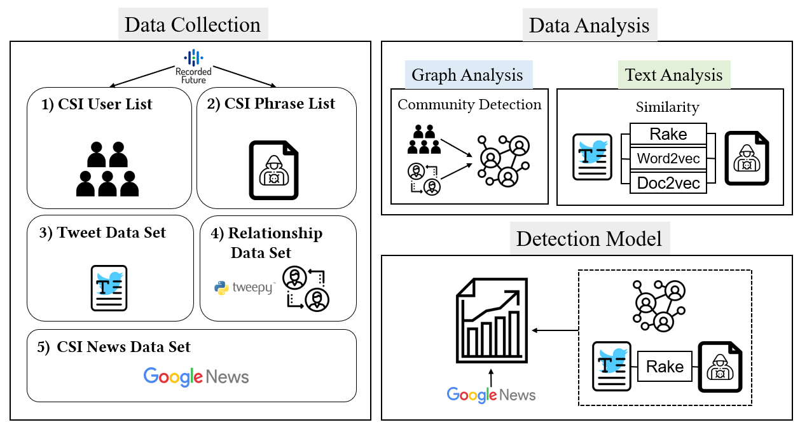

# Cyberattack detection model using community detection and text analysis on social media

[Paper](https://www.sciencedirect.com/science/article/pii/S2405959521001685)

by
**Jeong-Ha Park**, 
and Hyuk-Yoon Kwon*


This paper has been submitted for publication in ICT Express, Vol. 8, No. 4, Dec. 2022 (Impact Factor: 4.317, JCR Q1, Top 23%)
 (Ack: NRF-2021R1F1A1064050 and NRF-2019R1A6A1A03032119).



*The proposed framework to detect cyberattacks.*


## Abstract

> Online social media such as Twitter has been used as an important source for predicting, detecting, or analyzing critical social phenomena
such as elections, disease outbreaks, and cyberattacks. In this study, we propose a cyberattack detection model on social media. First, we
conduct community detection of users related to cyberattacks on Twitter to identify the most relevant group to the cyberattacks. Second, to
effectively identify the tweets related to cyberattacks, we conduct a textual similarity analysis between the tweet and the cyberattack relevant
keywords, which overcomes the limitation of lexical analysis of tweets such as keyword-based filtering and frequency of keywords. Finally, we
propose a novel cyberattack detection model by integrating both text- and graph-based models. Our methodology has a distinguishing feature
from the existing studies in that we incorporate the semantics in Tweets to evaluate the relevance with cyberattacks and employ community
detection to identify the most relevant group to the cyberattacks. Through extensive experiments, we show the effectiveness of the proposed
model. First, we show that the text analysis in the proposed model outperforms detection accuracy of the keyword frequency-based analysis
by up to 29.46%. Second, the community detection improves the detection accuracy by 28.89∼35.56% compared to the baseline criteria to
select relevant users to the cyberattacks. Through two experiments to measure the relevancy of detected communities to the cyberattack, the
results consistently show that the highest relevant community by our community detection shows the highest relevancy.


## Implementation

The source code for the three models used for text similarity analysis: Rake, Word2Vec, Doc2vec

is in the folders `./rake-nltk`, `./word2vec.model`, and `document-similarity-master`, respectively.

All other source code used to generate the results and figures in the paper are in the `codes` folder. 


For a detailed description of running the model, see the original GitHub repository.

1. [Rake](https://github.com/csurfer/rake-nltk)

2. [Word2vec](https://code.google.com/archive/p/word2vec/)

3. [Doc2vec](https://github.com/jhlau/doc2vec/blob/master/)

## Dataset

To collect tweet text dataset, you can use `DeepScrap`. 

It is built on [Scrapy](http://scrapy.org/) without using [Twitter's APIs](https://dev.twitter.com/rest/public).

A predefined list of hacker users is required. We obtain them from [Recorded Future](https://recordedfuture.com/), a reliable company specializing in cyber threat intelligence.

## Getting the code

You can download a copy of all the files in this repository by cloning the
[git](https://git-scm.com/) repository:

    https://github.com/parkjungha/CyberattackPrediction.git

or download a zip archive.


## Dependencies

You'll only need a working Python environment to run the code.
The recommended way to set up your environment is through the
[Anaconda Python distribution](https://www.anaconda.com/download/) which
provides the `conda` package manager.
Anaconda can be installed in your user directory and does not interfere with
the system Python installation.

We use `conda` virtual environments to manage the project dependencies in
isolation.
Thus, you can install our dependencies without causing conflicts with your
setup (even with different Python versions).


## Reproducing the results

Since the two models operate independently, we recommend using two anaconda virtual environments to avoid some conflicts.
Before running any code you must activate appropriate conda environment.

To preprocess tweet text data:

    python textAnalysis.py

To load detected groups into neo4j as a graph:

    python community.py

To calculate Word2Vec model similarity score for a tweet:

    python word2vec.py
    
To calculate Doc2Vec model similarity score for a tweet:

    python doc2vec.py
    
To calculate Rake model similarity score for a tweet:

    python rake-nltk.py

To calculate weight values by CSI keyword set:

    python keyword_weight_mapping.py
    
To calculate the relevance score between news and community groups

    python news_group_relavance.py


## Citation
If you use this code or ideas from the paper for your research, please cite our paper:
```
@article{park2022cyberattack,
  title={Cyberattack detection model using community detection and text analysis on social media},
  author={Park, Jeong-Ha and Kwon, Hyuk-Yoon},
  journal={ICT Express},
  volume={8},
  number={4},
  pages={499--506},
  year={2022},
  publisher={Elsevier}
}
```

## License

©2021 The Author(s). Published by Elsevier B.V. on behalf of TheKorean Institute of Communications and Information Sciences. This is an open
access article under theCCBY-NC-ND license (http://creativecommons.org/licenses/by-nc-nd/4.0/).
